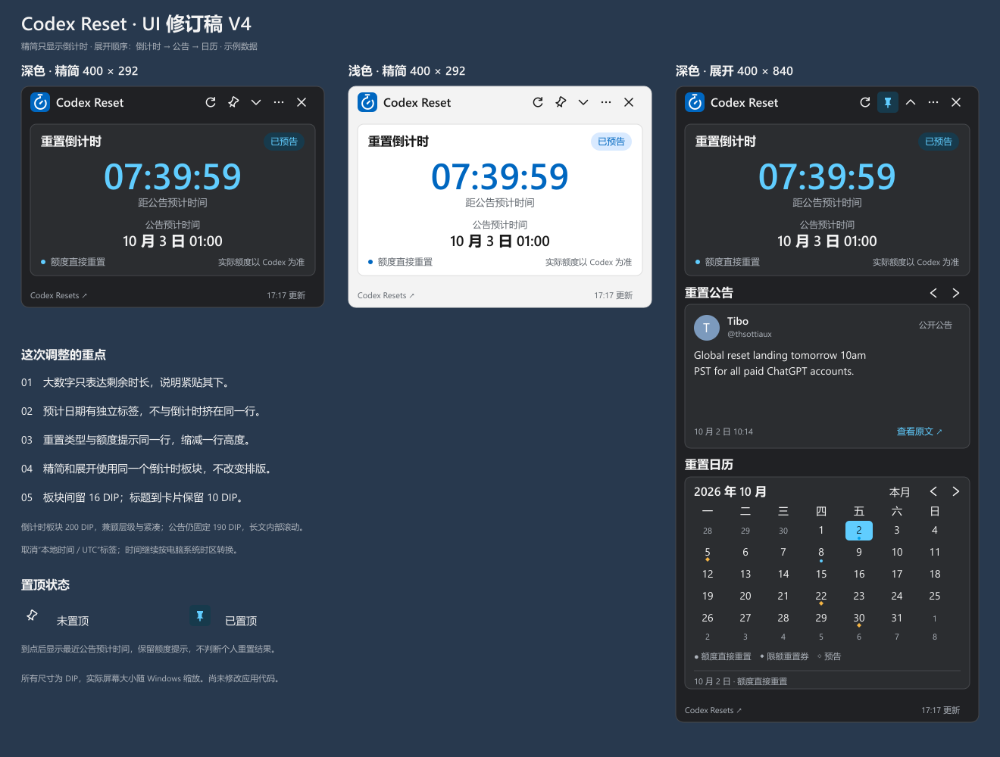

# codex-reset-widget

Windows 11 桌面重置追踪小组件。读取第三方已经分析好的 Codex 重置结果，展示下一次预计重置时间、Tibo 公告原文和历史重置日历。

M1、M2、M3 与 V4 UI 已通过用户检查。M4 发布候选版 1.0.0-rc.1 已形成，等待最终验收；干净 Windows 11 环境和实际多屏等现场验证仍待完成。更新日期：2026 年 10 月 2 日。

## 运行与开发

下载本地生成的 [M4 发布候选 ZIP](artifacts/milestones/m4/CodexResetWidget-1.0.0-rc.1-win-x64.zip)，完整解压后运行 `CodexResetWidget.exe`。包内包含 .NET 运行时和操作说明。默认读取真实公开数据；“…”菜单可查看版本、作者主页等关于信息。关闭窗口会收进托盘；从托盘菜单选择“退出”可结束运行。查看 [M4 验收记录](docs/milestones/m4-review.md) 了解测试结果和检查清单。

开发使用 `global.json` 锁定的 .NET SDK 10.0.401。在项目根目录运行：

```powershell
.\scripts\build.ps1                    # 编译并执行业务测试
.\scripts\build.ps1 -Publish -RunUiChecks -RunDesktopChecks -RunLiveChecks # 发布及解压、界面、桌面、联网检查
```

只做离线发布验证时可省略 `-RunLiveChecks`。需要检查已有测试数据的升级时，另传 `-UpgradeDataDirectory`，指向包含 settings.json 与 cache/snapshot.json 的目录；检查先复制到隔离位置，再启动解压包。

生成的 ZIP 包含使用说明、原始运行时许可及带文件哈希的 RELEASE.json。打包验证脚本也可以单独运行：

```powershell
.\scripts\verify-package.ps1 -ArchivePath artifacts\milestones\m4\CodexResetWidget-1.0.0-rc.1-win-x64.zip -RunDesktopChecks
```

SDK 可安装到系统或项目的 `.tools/dotnet/`。本工作区已配置本地 SDK；工具、依赖缓存和生成物不提交到 Git。

## 项目文档

- [需求文档](docs/requirements.md)：产品范围、三大功能、交互和验收标准。
- [技术设计](docs/technical-design.md)：WPF 方案、数据接口、状态判断、缓存、主题和验证计划。
- [开发计划](docs/development-plan.md)：四个 milestone 的交付、验收清单和用户检查暂停点。
- [M2 验收记录](docs/milestones/m2-review.md)：联网、缓存恢复与同步边界验证。
- [M4 验收记录](docs/milestones/m4-review.md)：发布包、升级兼容、验收覆盖与待验证环境。
- [使用与升级说明](docs/release-usage.txt)：解压启动、数据路径、升级与移除。
- [M3 验收记录](docs/milestones/m3-review.md)：托盘、位置恢复、主题与桌面操作验证。
- [视觉与交互规范](docs/design/visual-spec.md)：Windows 11 深浅色设计、布局、颜色及状态展示。
- [当前布局方案](docs/design/m3-ui-revision-proposal.md)：已验收的 V4 尺寸、公告翻阅与统一图标。
- [计时器 Logo](docs/design/countdown-logo.svg)：当前应用的蓝白矢量标识。



设计图中的日期、倒计时和历史记录属于示例内容，不代表当前状态。实际实现以需求文档和技术设计定义的数据语义为准。

## 技术方案摘要

- 平台：Windows 11 x64；使用 C#、WPF 和 .NET 10。
- 窗口：采用独立小窗口，供用户长期摆放在桌面上；Win+D 遵循系统默认行为。
- 首次启动默认精简，只展示重置倒计时；展开后依次展示倒计时、公告、日历，并记住用户选择。
- 数据：直接读取 [Codex Resets 状态 API](https://codex-resets.com/api/v1/status)，使用其解析后的 `scheduled_for`。
- 日历：从 [历史 API](https://codex-resets.com/api/v1/resets) 获取公告与观察记录。
- 第一版本地运行，使用文件缓存，无需自建服务器或分析每条 X 动态。
- 发布形式：Windows 11 x64 便携 ZIP，自带 .NET 运行时，解压后运行；设置与缓存保存在 `%LocalAppData%/CodexResetWidget/`。
- 深色、浅色和跟随系统三种主题设置。
- 日期与时间自动转换到电脑当前系统时区；到达预计时间后展示最近公告的预计重置时间，不判断个人额度是否恢复。

## 数据来源

Data from [Codex Resets](https://codex-resets.com/)。该服务免费且无需 API Key，要求展示来源链接。它是第三方追踪服务；倒计时到零不等于个人账户额度已经恢复。

项目代码许可见 [LICENSE](LICENSE)。第三方推文、标识和数据的使用遵循各自适用条款。
