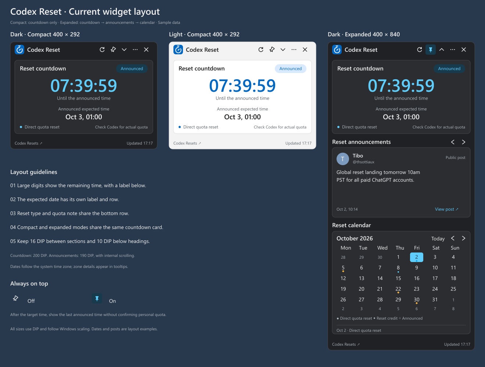

# Codex Reset

A Windows 11 desktop widget that shows expected Codex reset times, public announcements and reset history.

[简体中文](docs/README.zh-CN.md)

The current version is **1.0.0-rc.2**, a portable release candidate. Final user acceptance and testing on a clean Windows installation are still pending. See the [validation record](docs/validation.md) for the tested boundaries and remaining environments.

## Run

Download the locally generated [Windows x64 portable ZIP](artifacts/releases/CodexResetWidget-1.0.0-rc.2-win-x64.zip), extract the entire archive and run `CodexResetWidget.exe`. The package includes .NET; no separate runtime installation is required.

Before upgrading, exit the previous version from its tray menu. Extract the new version to a new folder and run it. Compatible settings and cached data are retained.

## Features

- Start in compact mode with the reset countdown. Expand to show announcements and the calendar; the app remembers your choice.
- Browse announcements with the previous and next buttons. Long posts scroll inside a fixed-height card.
- Drag the title bar to move the window. Use the pin button to keep it on top.
- Closing the window hides it in the tray. Use **Exit** in the widget or tray menu to quit.
- Choose the system, light or dark theme. Dates follow your computer's time zone.
- After the announced time, show the last expected reset time without claiming that your personal quota has been restored.
- Open **More → About Codex Reset** for the version, [Mengman's GitHub profile](https://github.com/Mengman), data source and license.

### Language

English and Simplified Chinese are supported. By default, the app follows the Windows display language: both Simplified and Traditional Chinese select Simplified Chinese; all other languages select English.

Use **More → Language** to select **Use system language**, **English** or **Simplified Chinese**. The selection is saved and applied immediately. Changing the interface language preserves the selected announcement, calendar month and reading position. Original announcement text is displayed as provided by the source.



Dates and posts in the illustration are layout examples. The [timer logo](docs/design/countdown-logo.svg) is shared by both languages. The [Chinese layout](docs/design/widget-layout.png) is also available.

## Build and test

The project uses C#, WPF and .NET 10. `global.json` pins SDK **10.0.401**. Install that SDK system-wide or under `.tools/dotnet/`.

```powershell
.\scripts\build.ps1                    # Release build and functional tests
.\scripts\build.ps1 -Publish -RunUiChecks -RunDesktopChecks -RunLiveChecks
```

Live checks need access to the public API. Omit `-RunLiveChecks` for offline package and desktop checks. To test an upgrade, also pass `-UpgradeDataDirectory <test-data-folder>` containing `settings.json` and `cache/snapshot.json`; the verifier copies them to an isolated folder before use.

Artifacts are written to `artifacts/releases/`. The ZIP includes instructions, runtime licenses and `RELEASE.json` with file hashes. A separate `.sha256` file verifies the ZIP. SDK files, dependency caches and generated artifacts are excluded from Git.

Tests are organized by functionality, including language policy, resource consistency, live switching and settings compatibility. See [development and testing](docs/development.md) for the full grouping and package-verification commands.

## Documentation

The detailed project documents currently use Simplified Chinese:

- [Requirements](docs/requirements.md): current scope, data semantics and acceptance criteria.
- [Architecture](docs/technical-design.md): modules, API, reset state, cache and Windows integration.
- [Visual specification](docs/design/visual-spec.md) and [UI layout](docs/design/ui-layout.md): current dimensions, themes and icons.
- [Development and testing](docs/development.md): builds, functional tests and UI checks.
- [Validation record](docs/validation.md): release results, screenshots and unverified environments.
- [English usage instructions](docs/release-usage.en.txt) and [Chinese usage instructions](docs/release-usage.txt).
- [Third-party notices](docs/third-party-notices.txt) and [MIT license](LICENSE).

## Data and storage

Data from [Codex Resets](https://codex-resets.com/). The app reads its status and history APIs and uses the parsed expected time. It does not scrape X, predict reset dates, sign in to OpenAI or read your personal quota. **Check Codex for your actual quota.**

Settings, cache and bounded logs are stored under `%LocalAppData%/CodexResetWidget/`. The current package targets Windows 11 x64. Startup registration, notifications, history filters, alternative sources, ARM64 and an installer are future options.
