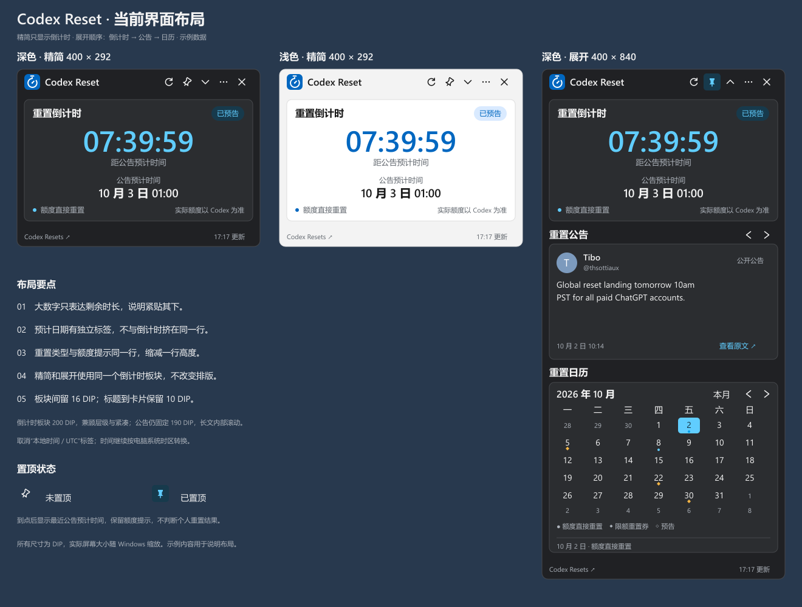

# codex-reset-widget

Windows 11 桌面重置追踪小组件，展示 Codex 预计重置时间、公开公告与重置历史。当前版本为 `1.0.0-rc.2` 发布候选版，等待最终用户验收；未验证环境见 [验证记录](validation.md)。

## 运行

从 [GitHub Releases](https://github.com/Mengman/codex-reset-widget/releases) 下载 Windows x64 便携 ZIP，完整解压后运行 `CodexResetWidget.exe`。本地构建包位于 `artifacts/releases/`。包内包含 .NET 运行时，无需另行安装 .NET。升级前从旧版托盘菜单退出，再将新版解压到新目录；兼容的设置与缓存继续保留。

- 首次启动默认精简，只展示重置倒计时；展开后依次显示倒计时、公告、日历，并记住用户选择。
- 公告左右按钮自由翻阅；卡片高度固定，长文在正文内滚动。
- 拖动标题栏移动窗口；图钉切换置顶。关闭窗口收进托盘，彻底退出通过菜单操作。
- widget 不出现在任务栏和 Alt+Tab 中；点击托盘图标可恢复窗口或将它唤到前台。
- “…” → “开机启动”默认关闭，用户勾选后在登录 Windows 时自动启动，取消勾选即可关闭。
- 支持跟随系统、浅色与深色主题；日期自动转换到电脑系统时区。
- 到达预计时间后显示最近公告的预计时间，不判断个人账户额度是否恢复。

详细操作、数据路径、升级与移除方法见 [使用说明](release-usage.txt)。

## 开发与检查

项目使用 C#、WPF、.NET 10，SDK 版本由 `global.json` 锁定为 10.0.401。SDK 可安装到系统或项目 `.tools/dotnet/`。

```powershell
.\scripts\build.ps1                    # Release 编译与 119 项功能测试
.\scripts\build.ps1 -Publish -RunUiChecks -RunDesktopChecks -RunLiveChecks
```

联网检查需要公开 API 可访问；离线发布检查可省略 `-RunLiveChecks`。检查旧数据兼容时，另传 `-UpgradeDataDirectory`，指向含 `settings.json` 与 `cache/snapshot.json` 的测试目录；脚本会复制到隔离位置，不直接修改输入目录。

生成物位于 `artifacts/releases/`。ZIP 包含使用说明、运行时许可、文件哈希清单 `RELEASE.json`，并生成独立 `.sha256` 文件。SDK、依赖缓存与生成物不提交到 Git。

测试按实际功能分组，分组清单和单独验证发布包的命令见 [开发与测试](development.md)。

## CI 与自动发布

GitHub Actions 在 PR、main 分支提交以及手动触发时执行构建、功能测试、WPF 场景及便携包验证，报告和构建包作为工作流产物保留 14 天。

将包含工作流文件的提交打上版本 tag 并推送即可发布：

```powershell
git tag -a v1.0.0 -m "Release 1.0.0"
git push origin v1.0.0
```

tag 格式为 `v主版本.次版本.修订版本`，可追加 `-rc.1` 等预发布后缀。tag 决定程序、关于、ZIP 和清单中的版本，无需提前修改 csproj。带后缀时发布为 Prerelease，否则发布为正式 Release。不要移动或重复使用已发布的 tag。

检查通过后，发布任务先创建草稿，上传 ZIP 和 SHA256 校验文件，再公开 Release 并自动生成说明。上传失败时可重新运行，重跑会替换同名附件。使用 GitHub 自动提供的 GITHUB_TOKEN，无需配置个人 Token；仓库需启用 Actions，且允许发布任务的 contents: write 权限。

CI 使用 Windows Server 托管环境；真实桌面、托盘、多屏和联网检查继续在本地执行。细节见[开发与测试](development.md)。

## 项目文档

- [需求](requirements.md)：当前产品范围、数据语义、交互与验收标准。
- [技术设计](technical-design.md)：架构、API、状态判断、缓存、主题与平台适配。
- [视觉规范](design/visual-spec.md)与[UI 布局](design/ui-layout.md)：当前尺寸、颜色、卡片和统一图标。
- [使用说明](release-usage.txt)：启动、操作、升级、移除及用户数据位置。
- [开发与测试](development.md)：构建、功能测试、界面与发布包检查。
- [验证记录](validation.md)：当前候选版的验证结果、截图和待验证环境。
- [第三方声明](third-party-notices.txt)及 [LICENSE](../LICENSE)：数据来源与许可。



图中日期与公告仅用于说明排版，不代表实时数据。[计时器 Logo](design/countdown-logo.svg)为当前应用标识。

## 数据来源

Data from [Codex Resets](https://codex-resets.com/)。应用直接读取该服务的状态与历史 API，使用其解析后的预计时间，不自行抓取 X 动态或预测重置时间。无需登录 OpenAI，也不读取个人额度。实际额度以 Codex 为准。

设置、缓存与日志位于 `%LocalAppData%/CodexResetWidget/`。第一版提供 Windows 11 x64 便携包；通知、历史筛选、备用数据源、ARM64 和安装包属于后续候选功能。


## 语言

程序默认跟随 Windows 显示语言：简体或繁体中文使用简体中文，其他语言使用英语。在“…” → “语言”中可选择跟随系统、English 或简体中文；选择会保存，切换后无需重启，公告原文保持不变。

[English README](../README.md)
