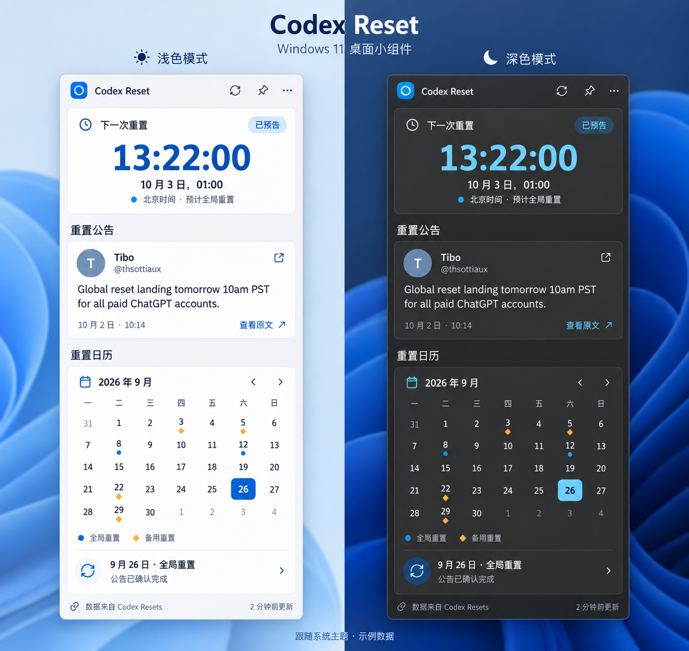

# Codex Reset Widget 视觉与交互规范

版本：0.1。整理日期：2026 年 10 月 2 日。方向：Windows 11 Fluent，浅色和深色具有一致的信息结构。

这是一张概念设计图。日期、倒计时、日历标记和“已确认完成”文案为示例，不作为真实事件证据。示例头像中的 T 为占位，不代表 Tibo 的真实头像。实现遇到数据语义冲突时，以[需求文档](../requirements.md)和[技术设计](../technical-design.md)为准。

> 用户已确认 [V4 UI 修订方案](m3-ui-revision-proposal.md)，下文与其冲突的尺寸、文案和默认模式以 V4 为准。实现记录见 [UI 修订验收](../milestones/m3-ui-v4-review.md)。

## 1. 布局与层级

M1 调整后的初始宽度为 440 DIP、展开高度为 1020 DIP；实际高度受工作区约束。设计图展示完整展开态，不把图中的物理像素直接当成 WPF 尺寸。窄屏与高缩放下允许纵向滚动，避免裁掉日历与来源署名。滚动条使用细轨道和主题颜色。

从上到下：

1. 标题栏：应用名称、刷新、置顶、更多菜单。
2. 公告板：状态标签、大字号倒计时、预计日期和时区。
3. 公告：作者与来源、原文、发布时间和外链。
4. 日历：月份切换、日期网格、图例与当天记录。
5. 页脚：Codex Resets 来源链接和更新时间。

主要间距使用 8 DIP 倍数；卡片内边距建议 16 DIP，卡片之间 12 至 16 DIP。应用窗口圆角参考 12 DIP，卡片约 8 DIP。最终窗口圆角与阴影优先服从 Windows 的实际窗口能力。

## 2. 主题颜色初值

以下是设计起点，实施时用语义资源名管理，并验证实际字体和底色下的对比度。

| 语义 | 浅色 | 深色 |
| --- | --- | --- |
| 窗口实色回退 | `#F3F3F3` | `#202020` |
| 卡片背景 | `#FFFFFF` | `#2B2B2B` |
| 主文字 | `#1A1A1A` | `#F3F3F3` |
| 次文字 | `#5D5D5D` | `#C1C1C1` |
| 边框 | `#DEDEDE` | `#454545` |
| 强调色 | `#0067C0` | `#60CDFF` |
| 强调底上的文字 | `#FFFFFF` | `#102A3A` |
| 备用重置标记 | `#9A6700` | `#F5B544` |

默认跟随系统应用主题，允许手动指定。系统强调色联动不属于第一版必需项。高对比度模式使用系统语义颜色；状态仍由文字和图形说明。

## 3. 字体与可操作性

- 英文与数字优先 Segoe UI Variable，中文使用系统可用的中文字体回退。
- 主倒计时建议 44 至 52 DIP，正文 14 DIP，辅助文字 12 至 13 DIP，区域标题 16 至 18 DIP。
- 数字尽量使用等宽字形，刷新时不引发横向抖动。
- 图标采用统一的 Fluent 线性风格。标题栏图标按钮建议至少 32 × 32 DIP，有工具提示、焦点边框和可访问名称。
- 超长原文可以展开或滚动，不缩小整张卡片的字体。

## 4. 公告板状态

有明确未来时间时展示大倒计时，注明“距公告预计时间”；无时间时用两行可理解文案占据同一区域，保持卡片高度稳定。未知值不显示为 `00:00:00`。预计时间已到后，标题改为“最近公告的预计重置时间”，大字号展示日期和时间，附“实际额度请以 Codex 中显示为准”。不显示完成勾号、“重置成功”或停在零的倒计时；更新失败及预告状态待确认使用独立辅助提示。

界面日期与时间自动转换到电脑当前系统时区。标签可显示“本地时间 · UTC+08:00”，偏移按所展示时刻计算；工具提示可补充系统时区名称。系统时区变更后同步更新展开态、紧凑态和日历，原始公告正文保持原样。设计图中的固定北京时间仅为示例。

记录类型用“全局重置”或“备用重置”。仅预测信号显示“时间未定”，不使用表示完成的勾号。观察记录使用中性标识。

## 5. 公告区交互

最新公告与历史阅读模式共用卡片。阅读历史时显示“历史公告”和“返回最新”；顶部公告板保持当前下一次预告。

查看原文使用外链图标和可点击文字。没有来源 URL 时隐藏该操作。卡片中的作者只在来源确认是 Tibo 推文时展示；第一版可以使用文字头像，不依赖头像下载。

## 6. 日历状态

- 周一开始，支持四至六行月份；六行月份增加卡片高度或整体滚动，不压缩点击目标。
- 今天使用细轮廓，选中日使用强调色填充；两者不能混为一项状态。
- 全局历史用圆点，备用历史用菱形，未来预告用空心标记。
- 同日多事件在日格显示数量，选中后展示完整列表。
- 上下月补位日期降低视觉权重但仍保持可辨认。
- 图例和详情明确显示记录类型，色弱用户无需仅凭颜色理解。

## 7. 设计图的实现边界

图中的蓝色 Windows 风格桌面背景只是展示环境，不应打包成组件背景。图中的两份窗口用于比较主题，运行时显示一个窗口。图片本身不作为可点击 UI；实际界面用 XAML 控件实现。

第一版包含紧凑态，只保留标题栏与公告板。标题栏提供带工具提示和可访问名称的“收起为紧凑态”／“展开”按钮，支持键盘操作。公告板保留倒计时或替代状态文案、重置类型、预计时间与时区，缓存或错误提示仍然可见；来源链接及最后成功更新时间可从菜单访问。

建议两种模式保持相同宽度，紧凑态高度按内容收缩，确保长状态文案和高缩放下不被裁切。恢复展开后保留之前的历史公告选择、日历月份和阅读位置。首次启动默认展开，之后恢复上次模式。紧凑态未包含在本次设计图中，实际尺寸需在 WPF 排版时验证。

## 8. 视觉验收

比较浅色和深色的层级、阅读顺序和点击区域；检查正文与辅助文字对比度。覆盖无预告、长推文、多事件日期、加载、离线、六行月历和高对比度。分别在 100%、150%、200% 缩放和较小工作区检查，确保倒计时、外链、菜单和日历都可操作。两种窗口模式均需覆盖适用状态，检查切换按钮、紧凑态提示及展开后的阅读位置恢复。
