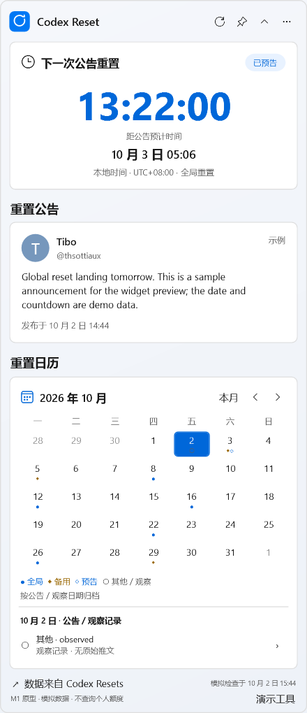
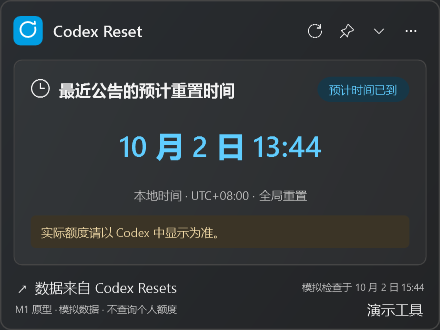
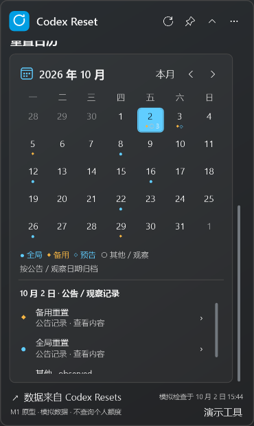

# M1 验收记录

日期：2026 年 10 月 2 日。状态：用户已检查通过，M1 已提交为 `1fc4c3e`。后续进度见 [M2 验收记录](m2-review.md)。

## 交付与运行

- [便携 ZIP](../../artifacts/milestones/m1/CodexResetWidget-0.1.0-m1-win-x64.zip)：约 62.2 MiB，Windows 11 x64，自带 .NET 10.0.12 运行时。
- [已解压的可执行文件](../../artifacts/milestones/m1/portable-review/CodexResetWidget.exe)：可直接运行本工作区中的原型。
- [操作说明](m1-usage.txt)：也包含在 ZIP 的 `README.txt` 中。

ZIP SHA256：`A8D605220CB79F3A55A4D51690AA8282C7C4CBF93AA49A2FEDFC16421210CF3E`。

完整解压后双击 `CodexResetWidget.exe`。页脚明确显示“M1 原型 · 模拟数据”。点击页脚“演示工具”切换场景和时区，点击右上角“…”切换主题。

本阶段实现展开／紧凑布局、公告板、公告阅读、日历与同日记录选择、主题切换、置顶和系统时区读取。到达预计时间后，倒计时替换为最近公告的预计重置时间，并显示“实际额度请以 Codex 中显示为准。”预告消失时保留此前预计时间并显示待确认提示。

## 开发环境

本机原有 .NET 运行时，但未配置 SDK。已在项目 `.tools/dotnet/` 安装官方 .NET SDK 10.0.401，锁定版本并完成编译、测试和发布。安装包经官方发布元数据中的 SHA512 校验；未更改系统 SDK 或用户全局环境变量。

工程使用 C#、WPF、MVVM；运行时依赖来自官方 NuGet。构建脚本将 SDK 临时状态及包缓存放在项目 `.tools/`，输出位于 `artifacts/`。这两个目录已加入 Git 忽略规则。

版本依据：[.NET 支持策略](https://dotnet.microsoft.com/en-us/platform/support/policy/dotnet-core)、[官方安装说明](https://learn.microsoft.com/en-us/dotnet/core/tools/dotnet-install-script)。

## 已执行验证

| 验证 | 结果与范围 |
| --- | --- |
| Release 编译 | 通过，0 警告、0 错误 |
| 业务测试 | 35 项通过：目标时间边界、预告消失及更正、观察记录语义、UTC 转换、半小时时区、夏令时、跨日归档、闰年及月历布局 |
| 实际 WPF 检查 | 13 项通过：两种布局、阅读与月份保留、时区切换、到点文案、预告消失、小窗口滚动、真实计时跨过目标时间；无绑定错误 |
| 视觉检查 | 本机 150% 缩放；检查深浅主题、紧凑态、长文本及小窗口滚动；导出 19 张实际 WPF 渲染快照 |
| 自包含发布 | 成功生成 x64 应用、运行时、项目许可和运行时许可，并打包 ZIP |

原始记录：[业务测试输出](../../artifacts/milestones/m1/domain-tests.txt)、[界面检查 JSON](../../artifacts/milestones/m1/captures/ui-checks.json)、[全部界面快照](../../artifacts/milestones/m1/captures/)。

本机检查不能替代不同 DPI、多显示器、休眠恢复和未安装 .NET 的干净 Windows 11 环境验收；这些继续安排在 M3／M4。真实 API、网络错误和缓存场景目前通过模拟展示，真实行为由 M2 实现并验证。托盘、位置和设置持久化也留在后续阶段。

## 请检查这些场景

- [ ] 默认展开态：公告板、公告与日历的信息层级和密度是否合适。
- [ ] 点击标题栏收起箭头：紧凑窗口是否适合长期摆放，预计时间是否清晰。
- [ ] 选择“12 秒后到点”：是否自然切换为日期，文案是否避免暗示个人额度已经恢复。
- [ ] 选择“预计时间已到”和“预告消失”：保留时间及待确认提示是否易懂。
- [ ] 切换“跟随电脑时区”、印度和美国时区：日期、时间、UTC 偏移是否清楚。
- [ ] 选择“同日多事件”和“长公告”：历史阅读、切换布局及滚动是否顺手。
- [ ] 切换深浅主题，查看时间未定、无预告、缓存和错误场景。

## M1 视觉修正

根据用户对实际界面与设计图差距的反馈，调整为 440 × 1020 DIP 的展开比例（受工作区约束），恢复粗体 Segoe UI 倒计时、紧凑卡片间距、浅色背景及深色渐变层次、统一线性图标、实色日历选中态和细滚动条。演示标识移至页脚，工具默认收起；公告时间的时区说明可通过工具提示查看。保留已确认的预计时间、到点和个人额度说明。重新执行 35 项业务测试和 13 项 WPF 检查，全部通过。

### 浅色展开态

### 深色紧凑态：预计时间已到

### 日历与当天记录

用户检查通过并明确同意后进入 M2；如需调整，先修正 M1。

### 标题栏拖拽与图标修正

标题栏采用 Windows 原生拖拽区域，操作按钮单独参与点击。使用真实鼠标操作验证：展开态从标题栏空白区域拖动后位置发生变化，收起按钮仍可点击；紧凑态从图标区域拖动也能移动窗口。左上角改为蓝色底、白色圆环的 XAML 矢量图标，避免字体字形差异。重新编译与执行 35 项业务测试、13 项 WPF 检查，全部通过。

