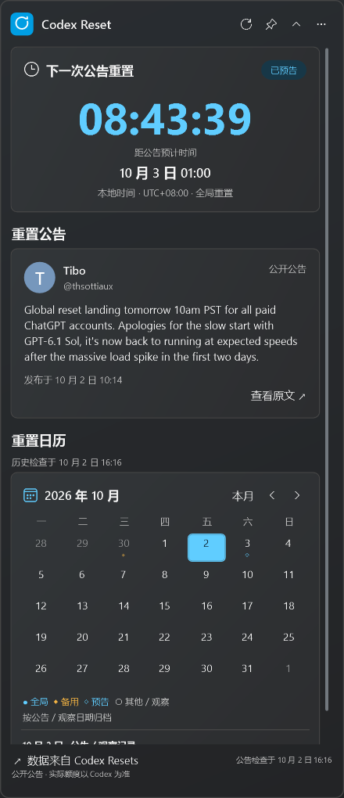
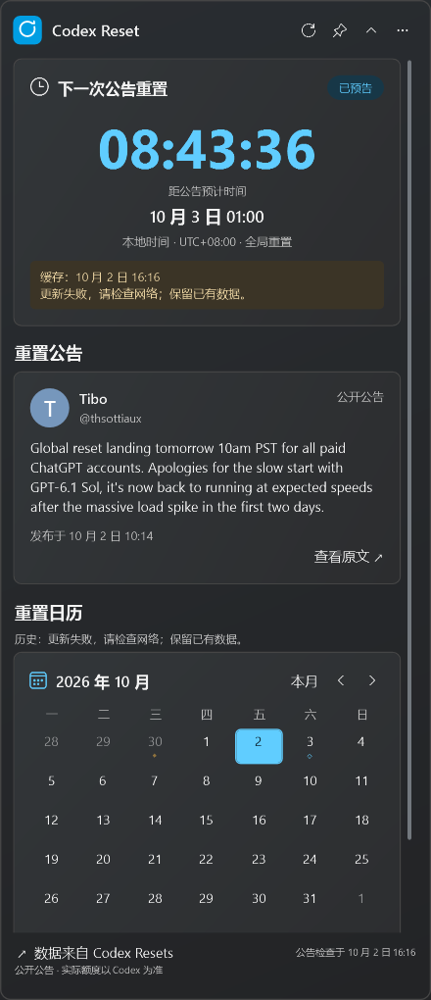

# M2 验收记录

日期：2026 年 10 月 2 日。状态：用户已通过，代码已提交为 `1ce6b4a`。M3 交付见 [M3 验收记录](m3-review.md)。

## 交付与运行

- [便携 ZIP](../../artifacts/milestones/m2/CodexResetWidget-0.2.0-m2-win-x64.zip)：完整解压后运行 `CodexResetWidget.exe`，自带 .NET 10 运行时。
- [已解压的应用](../../artifacts/milestones/m2/portable-review/CodexResetWidget.exe)。
- [操作说明](m2-usage.txt)：也包含在 ZIP 的 `README.txt` 中。

ZIP SHA256：`C4FD38A5AF47056E0E0466E3054CC4CDB41ECFA29B27D7229B33DC6D71256F1D`。

默认运行真实数据模式。菜单“打开独立演示窗口”保留场景与时区演示；两个模式在不同进程中运行，演示模式不会读写正式缓存。

## 实现范围

| 模块 | 当前行为 |
| --- | --- |
| API 适配 | 状态和历史 DTO；字符串 ID；明确时区转换为 UTC；未知类型中性显示；观察记录保留来源链接并使用中性作者信息 |
| 同步 | 状态每 5 分钟、历史每 30 分钟；启动／手动刷新完整分页，自动刷新接上已知记录后停止，每 6 小时完整核对 |
| HTTP | 每个 URL 保存 ETag 与有效响应体；发送 `If-None-Match` 与重新验证请求；304 无对应响应体时重新请求；15 秒请求超时 |
| 错误处理 | 429 遵循 Retry-After；其他错误按 5、10、20、30 分钟退避并加入小量抖动；同类请求最多一个在途，取消与请求序号防止迟到覆盖 |
| 缓存 | 版本化 JSON 快照，原子替换；保留最近预告、预计时间、历史、独立健康状态及 HTTP 条件请求上下文 |
| 阅读 | 刷新保留历史阅读对象与月份；“查看原文”打开来源 URL；上游生成时间可通过页脚检查时间的工具提示查看 |
| 健康信息 | 公告板与历史分别显示检查情况；缓存、陈旧、错误和部分历史提示；写入失败提示当前内容仍可阅读 |

用户数据位于 `%LocalAppData%/CodexResetWidget/`，缓存为 `cache/snapshot.json`，有限大小的诊断日志位于 `logs/`。缓存采用单个文件以便同时保存预告上下文与快照，替代原设计中的两个缓存文件。

## 已执行验证

- Release 编译：0 警告、0 错误。
- 67 项业务／同步测试通过，包括 M1 时间与日历规则，以及分页重复、部分失败、未知字段、304、限流、取消与迟到响应、独立调度、预告更正／消失、首次离线、缓存恢复、损坏／不兼容缓存、写入失败和取消写入保留原文件。
- 13 项实际 WPF 场景检查通过，无绑定错误；继续覆盖深浅主题、布局切换、时区、到点切换和小窗口滚动。
- 正常 Windows 环境下，两个真实 API 均成功，获取 56 条完整历史；公告 ID、原文链接及预计时间对应一致。
- 真实数据刷新后，历史阅读对象与月份均保留。
- 使用已生成的真实缓存重启，在接口请求失败时仍恢复公告、预计时间、全部 56 条历史与来源链接，并显示缓存／错误提示。

记录：[业务测试](../../artifacts/milestones/m2/domain-tests.txt)、[WPF 检查](../../artifacts/milestones/m2/captures/ui-checks.json)、[实际联网检查](../../artifacts/milestones/m2/live-captures/live-checks.json)、[缓存恢复检查](../../artifacts/milestones/m2/offline-captures/live-checks.json)。

本工作区沙箱内的 Windows TLS 握手失败，正常 Windows 环境运行同一份应用成功。联网检查在正常环境完成；缓存恢复检查借助沙箱中的请求失败进行，未修改系统网络或关闭 HTTPS 校验。网络恢复事件和休眠恢复后的调度已接入，实际系统事件、多种 DPI、多屏与干净环境验证继续安排在 M3／M4。当前没有托盘或窗口／主题设置持久化。

接口依据：[状态 API](https://codex-resets.com/api/v1/status)、[历史 API](https://codex-resets.com/api/v1/resets)、[OpenAPI](https://codex-resets.com/api/openapi.json)。此处记录是检查时的快照，不代表今后的公告内容。

## 请检查

- [ ] 默认运行显示真实公告，时间、类型和原文链接对应同一预告。
- [ ] 本地时间转换正确；到点语义仍表示公告预计时间。
- [ ] 在有历史记录的月份选择公告，刷新后阅读对象与月份保持。
- [ ] 返回最新后恢复当前公告；顶部公告板始终显示当前预告。
- [ ] 成功加载后关闭、重启；已有缓存时网络错误提示清楚，内容仍可阅读。
- [ ] 独立演示窗口明确标注模拟数据，操作不会改变真实窗口。

### 实际运行：深色

### 请求失败后恢复缓存

用户检查通过并明确同意后进入 M3。
