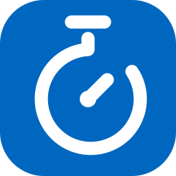
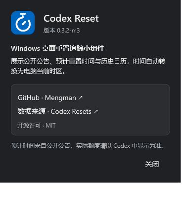
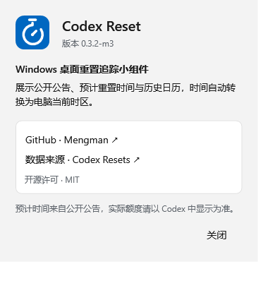

# M3 补充修改：关于与计时器 Logo

日期：2026 年 10 月 2 日。版本：0.3.2-m3。修改完成，等待用户检查；M4 尚未开始。

## 运行

- [便携 ZIP](../../artifacts/milestones/m3-about-logo/CodexResetWidget-0.3.2-m3-win-x64.zip)：完整解压后运行 `CodexResetWidget.exe`。
- [已解压的应用](../../artifacts/milestones/m3-about-logo/portable-final/CodexResetWidget.exe)。
- [使用说明](m3-about-logo-usage.txt)。

SHA256：`98380653BDDCE5C875161CDE118E61E4A0D305A2C09B9BBD466DE9665D030692`。

升级前从旧版托盘菜单选择“退出”。继续使用原有兼容设置和缓存。

## 修改内容

1. 删除“打开独立演示窗口”、演示工具和界面检查菜单，移除启动独立演示进程的代码及 `--demo` 模式。正式窗口没有模拟场景选择器。自动回归检查仍通过专用检查参数注入测试数据。
2. “…”菜单新增“关于 Codex Reset”：版本号来自运行程序集，显示 [Mengman 的 GitHub 主页](https://github.com/Mengman)、数据来源、MIT 许可及实际额度提示。链接使用系统默认浏览器打开。窗口随应用深浅主题变化，关闭后返回小组件。
3. 更换蓝白计时器 Logo：蓝色圆角底、白色进度环、顶部计时按键与简洁指针，取消原来的重置箭头。标题栏、窗口原生图标、托盘和“关于”共用矢量图形；EXE 嵌入 16、24、32、48、64、128、256 像素图标。

源图：[SVG](../design/countdown-logo.svg)；运行资源：`Resources/Logo.xaml`；EXE 图标：`Resources/Application.ico`。Logo 用矢量几何构建，PNG 与多尺寸 ICO 从同一 SVG 导出。

## 验证

- Release 构建：0 警告、0 错误。
- 84 项业务／同步／设置测试通过。
- 13 项 WPF 场景检查通过，无绑定错误。
- 46 项桌面检查通过；新增菜单无调试入口、关于入口、实际版本、指定 GitHub 地址、窗口布局与所属关系、关闭关于后主窗口继续运行、EXE 内嵌图标检查。
- 已目视检查深浅色关于窗口、计时器图案和小尺寸标题栏图标。未自动点击外链打断用户浏览器。

测试报告：[界面](../../artifacts/milestones/m3-about-logo/captures/ui-checks.json)、[桌面](../../artifacts/milestones/m3-about-logo/desktop-captures/desktop-checks.json)。实际多屏、系统缩放变化、休眠和干净 Windows 发布验证仍未补做，沿用此前记录；最终发布工作属于 M4。

| 深色关于 | 浅色关于 |
| --- | --- |
|  |  |

关于截图由 WPF 导出，原生窗口标题栏与边框不包含在导出内容中。

**暂停点：检查关于信息、新 Logo 与菜单；本次不进入 M4。**
