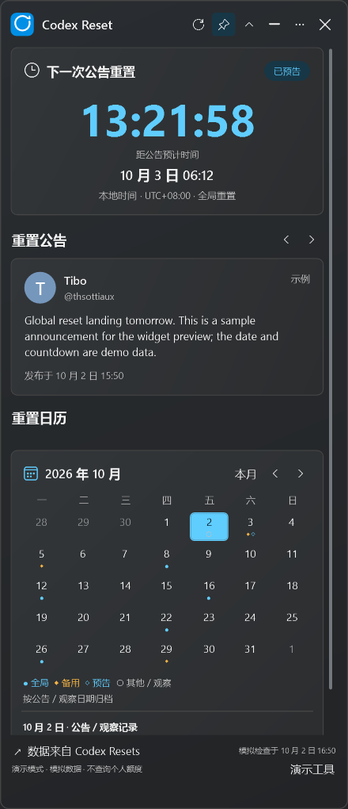
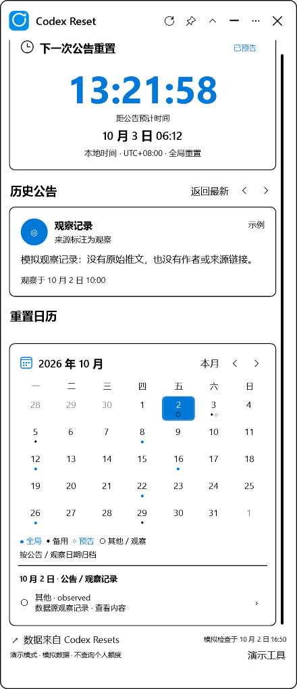
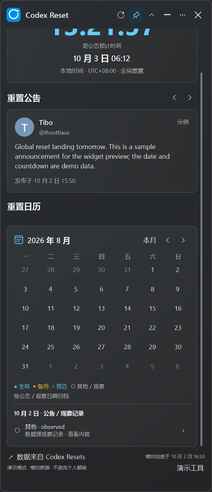

# M3 验收记录

日期：2026 年 10 月 2 日。版本：0.3.0-m3。状态：阶段内验证通过，等待用户检查。M4 尚未开始。

## 交付与运行

- [便携 ZIP](../../artifacts/milestones/m3/CodexResetWidget-0.3.0-m3-win-x64.zip)：完整解压后运行 `CodexResetWidget.exe`，自带 .NET 运行时。
- [已解压的应用](../../artifacts/milestones/m3/portable-final/CodexResetWidget.exe)。
- [操作说明](m3-usage.txt)：也包含在 ZIP 的 `README.txt` 中。

ZIP SHA256：`19537FBECE5B8BFE94454884D56D86450B2C36F3BFD538D3328D960EF33A90C5`。

升级前先从旧版托盘菜单选择“退出”，再运行新版。当前已打开的检查窗口可以继续使用；最终包在独立目录中。

## 实现范围与模块对应

| 模块／类 | 当前行为 |
| --- | --- |
| `MainViewModel` | 公告前后切换、历史阅读、返回最新、日历导航与原文外链；阅读历史保持顶部公告板独立 |
| `DesktopSettings`、`SettingsStore` | 版本化 JSON 设置与原子写入；保存模式、展开尺寸、位置、显示器、置顶、主题和首次托盘说明；损坏或不可写时回退并提示 |
| `PlacementPolicy`、`WindowPlacementService` | 以原生像素保存位置，按目标显示器 DPI 恢复 DIP 尺寸；工作区修正，原显示器不存在时选择可用显示器 |
| `ThemeService`、`WindowBackdrop` | 跟随系统／浅色／深色，系统主题变化响应，高对比度系统颜色；原生 Mica 与实色回退 |
| `TrayService` | 与标题共用蓝色圆环图标；显示、收进托盘、刷新和退出；左键点击恢复窗口 |
| `MainWindow` | 可拖动、置顶状态高亮、最小化、关闭收进托盘；首次关闭说明；恢复阅读位置与展开尺寸；响应时钟、时区、恢复运行及显示器变化 |
| 生命周期 | 隐藏／最小化停止秒级界面计时，后台同步保留；恢复重新计算时间；显式退出清理托盘、计时器、订阅和网络任务 |

设置位于 `%LocalAppData%/CodexResetWidget/settings.json`，缓存仍位于 `cache/snapshot.json`。普通演示窗口不读写正式设置或缓存；自动检查使用隔离目录。

Mica 使用 DWM 的主窗口背景材质；关闭透明效果、系统不支持或进入高对比度时回退。[微软 DWM 背景材质文档](https://learn.microsoft.com/en-us/windows/win32/api/dwmapi/ne-dwmapi-dwm_systembackdrop_type)

## 已执行验证

构建命令：` .\scripts\build.ps1 -Publish -RunUiChecks -RunDesktopChecks `。

- Release 构建：0 警告、0 错误。
- 84 项业务／同步／设置测试通过：包含此前 67 项与新增 17 项位置、缩放、损坏设置、兼容性和写入失败检查。
- 13 项实际 WPF 场景检查通过，无绑定错误。
- 24 项实际 WPF 桌面检查通过：公告前后切换、阅读／月份／滚动保持、置顶高亮、设置落盘、隐藏／最小化计时停止、托盘恢复跨过预计时间、首次关闭说明及退出清理。
- 本机为单屏、150% 缩放（DPI 144）；DWM 接受 Mica，原生窗口外观已观察。真实预览中的位置和手动主题变化已写入隔离设置。
- 100%、150%、200% 等效工作区布局检查与位置策略测试通过；六行月历、小工作区可滚动。缺失显示器的恢复使用模拟保存位置和实际窗口修正验证。
- 高对比度检查注入系统颜色模式，确认 Mica 关闭和界面资源切换；时区检查注入时区，确认阅读保持与绝对倒计时不变。

机器可读报告：[业务测试](../../artifacts/milestones/m3/domain-tests.txt)、[界面检查](../../artifacts/milestones/m3/captures/ui-checks.json)、[桌面检查](../../artifacts/milestones/m3/desktop-captures/desktop-checks.json)。

界面截图为 WPF 导出，使用实色回退背景；它们不包含 Windows 合成器的 Mica 效果。

| 深色 | 高对比度 |
| --- | --- |
|  |  |

## 尚未现场验证的环境

没有修改电脑的缩放、时区、高对比度或休眠设置。实际 100%／200% 系统缩放、跨显示器拖动、物理显示器断开、系统主题／时区切换、真实休眠跨过预计时间和 Win+D 仍需用户或相应环境检查。模拟检查不能替代这些现场结果。

干净 Windows 环境的解压运行、升级和最终发布验收留在 M4。

## 用户检查清单

- [ ] 拖动、大小、置顶与顶部图标符合预期。
- [ ] 紧凑／展开、主题切换和刷新保持阅读对象、月份与滚动位置。
- [ ] 关闭收进托盘、点击托盘恢复、菜单退出符合日常使用习惯。
- [ ] 从菜单退出后重启，模式、位置、展开尺寸、主题和置顶恢复正确。
- [ ] Win+D 后恢复窗口，时间显示正确；到点显示预计时间和实际额度提示。
- [ ] 系统主题／时区变化和可用的缩放／多屏环境表现符合预期。

**暂停点：等待 M3 检查结果，通过后再进入 M4。**
