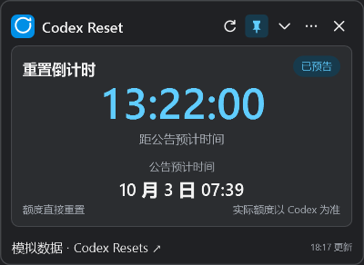
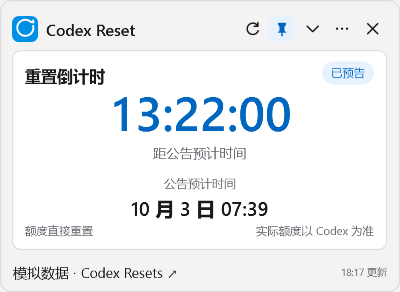
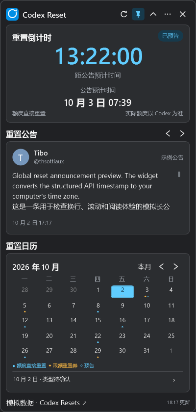

# M3 UI V4 修订验收

日期：2026 年 10 月 2 日。版本：0.3.1-m3-ui-v4。用户已确认此前需求全部完成，M3 和 V4 UI 修订通过验收。实现提交：`23ad0b3`；M4 尚未开始。

## 运行

- [便携 ZIP](../../artifacts/milestones/m3-ui-v4/CodexResetWidget-0.3.1-m3-ui-v4-win-x64.zip)：完整解压后运行 `CodexResetWidget.exe`。
- [已解压的应用](../../artifacts/milestones/m3-ui-v4/portable-final/CodexResetWidget.exe)。
- [操作说明](m3-usage.txt)，已包含在包内 `README.txt`。

SHA256：`88A5808C26FCD3460D39A6DE3FA3E759BC673E16CD056C8334C5ECD97B2E0F24`。

先从旧版托盘菜单选择“退出”，再运行新版。正式模式仍读取真实 API 和原有用户数据。首次启动没有设置时，默认精简、宽 400 DIP；已有设置继续恢复原来的模式、大小、位置、主题与置顶。升级不会强制覆盖用户上次的展开选择。

## 修改结果

| 用户要求 | 实现 |
| --- | --- |
| 隐藏本地时间标签 | 倒计时保留系统时区转换，时区只通过日期工具提示查看 |
| 公告自由翻阅 | 标题固定“重置公告”，取消“返回最新”，左右按钮按发布时间翻阅 |
| 统一公开公告作者 | 回复帖／转推的 Tibo 原文链接也展示 Tibo、@thsottiaux 与 T；界面不再依据 observed 标签改为观察头像。缺少归属证据时不伪造作者 |
| 公告固定高度 | 190 DIP；正文单独滚动，发布时间与原文链接固定；不同公告切换不推动日历 |
| 清楚区分重置方式 | regular 为“额度直接重置”，banked 为“限额重置券”；工具提示解释手动使用，保留内部类型 |
| 默认精简并记忆 | 默认只显示倒计时；手动展开后继续保存，下次恢复；展开顺序为倒计时、公告、日历 |
| 置顶明确 | 空心斜图钉／蓝色实心直图钉，背景及工具提示同步变化 |
| 紧凑布局 | 默认宽 400、精简高 292、展开高 840 DIP；倒计时 200、公告 190、六行日历 284 DIP；系统工作区不足时可滚动 |
| 图标统一 | 16×16 DIP 矢量图标，28×28 DIP 按钮，1.5 DIP 线宽；标题栏、公告翻页与日历翻月共用实现 |

数据异常提示仍可显示；它们可能使内容需要滚动。日历当天多个事件在底部列表中滚动查看，点击后更新公告。关闭收进托盘、恢复计时、后台同步与清理行为保留。

## 验证

运行 ` .\scripts\build.ps1 -Publish -RunUiChecks -RunDesktopChecks `：

- Release 构建：0 警告、0 错误。
- 84 项业务／同步／设置测试通过。位置测试保留旧尺寸显式样本，并验证新版默认尺寸。
- 13 项 WPF 场景检查通过，无绑定错误，覆盖预告、到点、无时间、长文、缓存与错误等状态。
- 39 项桌面检查通过，新增固定公告高度、日历位置稳定、长文内部滚动、正文阅读位置保持、切换公告回到开头、统一图标／按钮尺寸、浅色文字颜色、精简无裁切、展开完整月历、Tibo 回复原文身份和无证据不伪造作者等检查。
- 原有置顶、设置、时区、托盘、隐藏／最小化计时、恢复跨过目标和退出清理检查继续通过。

本机为单屏、150% 缩放。100%／200% 工作区和缺失显示器使用模拟检查；实际多屏、系统时区变化与真实休眠仍沿用 [M3 未验证项](m3-review.md)。截图使用 WPF 实色背景导出，不能代表原生 Mica 合成效果。

报告：[业务测试](../../artifacts/milestones/m3-ui-v4/domain-tests.txt)、[界面检查](../../artifacts/milestones/m3-ui-v4/captures/ui-checks.json)、[桌面检查](../../artifacts/milestones/m3-ui-v4/desktop-captures/desktop-checks.json)。

## 与批准设计的核对

参照 [V4 图稿](../design/m3-ui-revision-layout.png) 与实际 WPF 截图，核对了：

1. 精简与展开的顺序、400 DIP 同宽、200 DIP 倒计时及 190 DIP 公告高度。
2. 倒计时字号、紧邻的时长说明、独立的预计时间标签与日期、底部同排的类型与额度提示。
3. 深浅色文字、卡片、背景及强调色。
4. 统一按钮画布、线宽、左右箭头和两种置顶形状。
5. 板块标题与卡片间距，没有重叠；六行月历和页脚能在默认展开尺寸内显示。
6. 固定作者行和底行，长正文单独滚动。

有意保留的差异：演示模式以“示例公告”和“模拟数据”明确标识；日期和原文由数据驱动；日历底部为可滚动的当天记录列表，未知类型保持中性展示；Windows 实际字体排版与 SVG 存在小量字形差异；原生 Mica 由系统合成。截图与设计图不会使用相同的假时间冒充真实数据。

| 深色精简 | 浅色精简 |
| --- | --- |
|  |  |

**阶段结论：M3 用户验收通过。后续进入 M4 需用户明确要求继续。**
