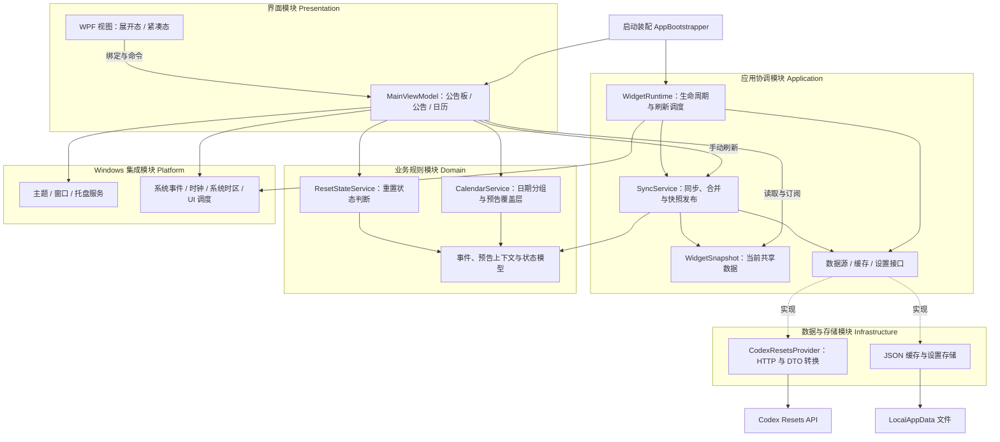
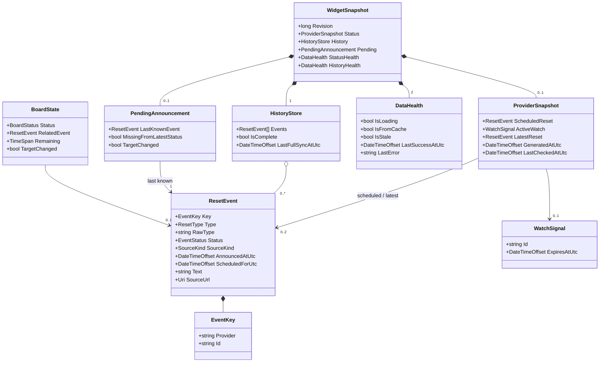

# Codex Reset Widget 技术设计

版本：0.3。更新日期：2026 年 10 月 2 日。本文描述完整目标架构；M1 已通过用户检查，M2 已实现真实数据接入、同步调度和缓存，验证结果见 [M2 验收记录](milestones/m2-review.md)。M3 已实现桌面交互、设置恢复、主题与托盘，见 [M3 验收记录](milestones/m3-review.md)；最终发布验收留在 M4。

## 1. 技术决策

采用 C#、WPF、XAML 和 MVVM。工程已选择 .NET 10，并用 `global.json` 锁定 SDK 10.0.401。第一版面向 Windows 11 x64；ARM64 和其他 Windows 版本暂不承诺。

使用 `HttpClient` 请求数据，`System.Text.Json` 反序列化，JSON 文件保存设置和缓存。托盘通过 `TrayService` 封装 `System.Windows.Forms.NotifyIcon`；WPF 负责窗口和 DPI。第一版不引入数据库、后端服务、X 抓取器或自然语言解析器。

发布形式已确定为 Windows 11 x64 便携 ZIP，采用自包含发布（`win-x64`、`SelfContained=true`），随包提供 .NET 运行时。第一版打包完整发布目录，用户解压后运行其中的应用程序；不要求合并为单个 EXE。

## 2. 数据来源与调研结论

| 来源 | 用途与结论 |
| --- | --- |
| [Codex Resets](https://codex-resets.com/) | 主源，公开 API 包含已经分析好的 `scheduled_reset.scheduled_for` |
| [Codex Reset](https://codex-reset.com/api/forecast) | 对照来源，可给出窗口与截止时间；`target_at` 不一定表示精确执行时刻 |
| [NextReset](https://nextreset.ai/api/forecast) | 提供整理结果，但本次查到的重置信号依赖 Codex Resets，不能作为独立确认 |
| [aiidelist](https://aiidelist.com/zh/codex-reset) | 原始调研入口，部分历史来自 Codex Resets；第一版不再增加这层转接 |

本轮已实测主源状态 API、历史 API 和 OpenAPI 定义。它免费且不需要 Key，展示数据时需要保留来源链接。当前调用成功不代表可用性或更新速度承诺。

同一条公告在不同站点可能得到不同的时间解释。本应用采用主源的结构化结果，显示“预计”与来源；不在客户端重新解释 PST、tomorrow 等文本，也不把多站一致当成独立证据。

## 3. 组件结构

第一版采用单进程 WPF 应用，内部按界面、应用协调、业务规则、数据与存储、Windows 集成划分模块。以下为完整目标架构，类名和方法用于表达职责；M1 已实现其中的界面、模拟数据、状态判断、日历和时区部分。模块按目录组织在一个应用项目中，业务测试放入测试项目。

### 3.1 模块设计图

箭头表示调用或使用关系。应用协调模块通过接口访问数据和存储；接口由基础设施实现。Windows 集成通过回调传递系统事件，不引用具体 ViewModel。



| 模块 | 核心职责 | 边界 |
| --- | --- | --- |
| Presentation | 数据绑定、文案格式化、阅读选择、日历导航、窗口模式命令 | 不解析 API JSON，不读写缓存，不自行推断完成事件 |
| Application | 启停、刷新调度、取消与退避、历史合并、维护并发布快照 | 不持有 WPF 控件，不生成界面文案 |
| Domain | 事件模型、预告状态判断、剩余时间、按时区生成月历 | 不访问网络、文件或 WPF；当前时间与时区显式传入 |
| Infrastructure | HTTP、DTO 校验与转换、条件请求、JSON 文件持久化 | 返回规范化数据及请求结果，不返回 UI 文案 |
| Platform | 窗口尺寸与位置、主题、托盘、系统事件、时钟、UI 线程调度 | 将系统能力封装为服务，不处理重置业务规则 |

### 3.2 核心类图：协调与展示

图中实线箭头表示持有引用，虚线箭头表示使用，空心三角表示接口实现，实心菱形表示生命周期内拥有的子对象。方法省略部分参数、异步返回类型和事件声明，以便阅读。

```mermaid
classDiagram
    class WidgetRuntime {
        +StartAsync()
        +StopAsync()
        +RequestRefresh(reason)
    }
    class SyncService {
        +WidgetSnapshot Current
        +InitializeAsync()
        +RefreshAsync(scope, cancellation)
        +SnapshotChanged
    }
    class IResetDataProvider {
        <<interface>>
        +GetStatusAsync(request)
        +GetHistoryPageAsync(request)
    }
    class CodexResetsProvider
    class ICacheStore {
        <<interface>>
        +LoadAsync()
        +SaveAsync(snapshot)
    }
    class JsonCacheStore
    class MainViewModel {
        +WindowMode Mode
        +RefreshCommand
        +ToggleModeCommand
        +ApplySnapshot(snapshot)
        +RecalculateTime()
    }
    class BoardViewModel {
        +BoardState State
        +TimeSpan Remaining
        +DataHealth StatusHealth
    }
    class AnnouncementViewModel {
        +EventKey SelectedEvent
        +bool IsReadingHistory
        +SelectEvent(key)
        +ReturnToLatest()
    }
    class CalendarViewModel {
        +DateOnly VisibleMonth
        +DateOnly SelectedDate
        +ShowMonth(month)
        +SelectDate(date)
    }
    class ResetStateService {
        +Evaluate(snapshot, nowUtc) BoardState
    }
    class CalendarService {
        +BuildMonth(snapshot, month, zone) CalendarMonth
    }
    class IClock {
        <<interface>>
        +DateTimeOffset UtcNow
    }
    class ITimeZoneService {
        <<interface>>
        +TimeZoneInfo CurrentZone
        +Refresh()
        +ZoneChanged
    }
    class SystemTimeZoneService
    WidgetRuntime --> SyncService
    WidgetRuntime ..> IClock
    SyncService --> IResetDataProvider
    SyncService --> ICacheStore
    SyncService ..> IClock
    CodexResetsProvider ..|> IResetDataProvider
    JsonCacheStore ..|> ICacheStore
    MainViewModel --> SyncService
    MainViewModel ..> IClock
    MainViewModel --> ITimeZoneService
    WidgetRuntime --> ITimeZoneService
    SystemTimeZoneService ..|> ITimeZoneService
    MainViewModel ..> ResetStateService
    MainViewModel ..> CalendarService
    MainViewModel *-- BoardViewModel
    MainViewModel *-- AnnouncementViewModel
    MainViewModel *-- CalendarViewModel
```



- `WidgetRuntime` 统一启动、停止和调度：定时、网络恢复与系统恢复都进入同一个刷新入口。状态与历史各自维护刷新周期；显示用的秒级时钟不会触发网络请求。
- `SyncService` 是共享业务数据的唯一写入入口。它管理每类请求的取消、序号、退避和分页；在受保护的合并步骤中基于最新快照提交结果，避免状态与历史请求互相覆盖。发布后由 UI 调度器将更新送到 `MainViewModel`。
- `CodexResetsProvider` 封装传输与转换。请求结果区分成功、304、限流和错误，并携带 ETag、Retry-After 等元数据。条件缓存按完整 URL 保存，ETag 必须与相应响应内容配对；没有对应内容时执行无条件请求。重试时间由应用层决定。
- `ResetStateService` 是无副作用的规则服务，接收快照与当前时间，返回业务状态、关联事件及剩余时间。它不读取历史阅读选择，也不直接生成中文文案。
- `CalendarService` 根据历史、未来预告、月份与显示时区生成日历数据。历史使用公告／观察日期，预告覆盖层使用目标日期；没有目标时间的预告不强行放入日期格。
- `MainViewModel` 协调三个子 ViewModel。日历事件选择只更新公告阅读对象；展开／紧凑切换只影响布局和窗口尺寸。主题切换与数据刷新均保留阅读选择。

平台与设置类不展开进主类图，避免混淆主数据路径：`ThemeService` 管理资源字典，`WindowService` 管理窗口模式和位置，`TrayService` 提供菜单动作，`SystemEventSource` 产生系统事件，`IUiDispatcher` 负责 UI 线程切换。`ISettingsStore` / `JsonSettingsStore` 单独加载与保存 `UserSettings`，不与业务缓存共用刷新生命周期。`AppBootstrapper` 创建这些对象并连接回调，`WidgetRuntime` 负责退出时取消任务、解除订阅与释放资源。

### 3.3 核心类图：数据与业务状态



模型约定：

- 图中省略可空标记；首次启动的状态、当前预告、观察信号、最近记录、目标时间、来源 URL 和尚未产生的时间戳均允许为空。时间统一使用 `DateTimeOffset`，ID 保留字符串。
- `EventStatus` 保留来源明确提供的事件阶段，并包含未知值；同 ID 出现在历史页不自动构成发生证据，还必须是来源明确记录为已发生的事件。该信息仅用于来源详情和历史。`BoardStatus` 包含无预告、有信号、时间未定、倒计时和最近公告预计时间，不包含个人重置完成状态；预告消失作为独立提示，不覆盖已有预计时间。
- `PendingAnnouncement` 保存上一条预告的上下文并写入缓存。到点或来源收录发生记录后仍保留其预计时间供公告板回顾；新响应不再包含该预告时，补充“预告状态待确认”。目标更正时更新上下文；明确的新预告可以替换它，但不会据此把旧预告标记为完成。此类型的 Pending 指预告跟踪上下文，不表示等待核实个人额度。
- `WidgetSnapshot` 以不可变快照发布。`Revision` 用于本地通知排序；请求序号另由 `SyncService` 管理。UI 不直接修改快照中的集合。
- `DataHealth` 使用独立标志与时间，允许“正在刷新 + 显示缓存 + 上次请求失败”同时成立。状态与历史分别记录健康信息，避免历史失败让有效的当前状态被误判为失败。上游生成时间另行保留，HTTP 检查成功不等于上游内容已更新。
- 公告阅读选择、日历月份和滚动位置属于界面会话状态，不写入 `ProviderSnapshot`。跨重启保存窗口模式和尺寸由 `UserSettings` 负责；第一版不要求跨重启恢复历史阅读位置。

### 3.4 主要运行过程

1. **启动**：装配服务 → 加载设置与有效缓存 → 发布初始快照 → 展示窗口 → 启动状态与历史同步。缓存损坏时跳过对应文件，首次离线显示明确空状态。
2. **刷新**：合并触发 → 请求与校验 → 按来源和 ID 合并数据 → 更新未确认预告上下文 → 发布新快照并保存缓存。缓存写入失败只记录本地持久化错误，不把成功的网络请求改成失败，也不丢弃有效内存数据；缓存写入串行化，旧快照不得覆盖新快照。
3. **显示更新**：快照变化时重算业务状态与日历；每秒只更新可见公告板的剩余时间。时区变化时重新分组日历，恢复显示或休眠恢复时按当前时钟重算。
4. **阅读与切换**：选择历史事件只改变公告区；切换窗口模式保留同一组 ViewModel，并由窗口服务调整尺寸。
5. **退出**：停止触发源 → 取消并等待在途任务 → 保存设置与完成待写缓存 → 清理托盘和系统订阅 → 关闭应用。

### 3.5 建议目录与验证边界

```text
src/CodexResetWidget/
  App.xaml / AppBootstrapper.cs
  Presentation/       Views、ViewModels、文案与格式化
  Application/        WidgetRuntime、SyncService、存储与数据源接口
  Domain/             Models、ResetStateService、CalendarService
  Infrastructure/     Api、DTO、Persistence
  Platform/           Windows、Theme、Tray、SystemEvents、Clock、Dispatcher
  Resources/          主题字典、图标
tests/CodexResetWidget.Tests/
```

优先验证三个边界：业务规则使用固定时间与模拟事件测试；同步服务使用假数据源和缓存测试分页、取消、304、乱序与损坏文件；桌面集成在实际 Windows 环境验证主题、DPI、窗口模式切换及退出清理。数据源接口和存储接口是测试替换点，纯业务服务无需为每个类增加接口。

## 4. API 合约

### 4.1 当前状态

`GET https://codex-resets.com/api/v1/status`

关键字段：

| 路径 | 处理方式 |
| --- | --- |
| `data.scheduled_reset` | 可为空；包含待执行预告 |
| `scheduled_reset.id` | 字符串，禁止转成浮点数处理 X ID |
| `scheduled_reset.reset_type` | 当前公开类型为 `regular` 与 `banked` |
| `scheduled_reset.announced_at` | 公告发布时间 |
| `scheduled_reset.scheduled_for` | 可为空的目标时间，按 `DateTimeOffset` 解析 |
| `scheduled_reset.text` / `source` | 原文与出处 |
| `data.active_watch` | 预测或观察信号；其中的过期时间不是重置时间 |
| `data.latest_reset` | 最近任意类型记录，可能是备用重置，不能直接称为最近全局重置 |
| `meta.generated_at` | 上游响应生成时间，不等于实际抓取推文或完成重置的时间 |

2026 年 10 月 2 日实测字段摘录，仅用于说明合约，不用于初始化线上倒计时：

```json
{
  "id": "2105843926221660585",
  "status": "scheduled",
  "reset_type": "regular",
  "announced_at": "2026-10-02T02:14:51.000Z",
  "scheduled_for": "2026-10-02T17:00:00Z"
}
```

### 4.2 历史记录

`GET https://codex-resets.com/api/v1/resets?limit=100&order=desc`

使用 `pagination.has_more` 和 `pagination.next_cursor` 顺序分页。初始加载获取完整可用历史，合并时按来源与 ID 去重。周期更新优先请求最近一页；若第一页已满且尚未覆盖本地已知记录，继续分页，直至接上本地记录或到末页。定期或用户主动刷新历史时，重新分页核对更正。

只拿到部分页时，不删除旧历史，不把缺失解释为撤回。分页期间新增记录可能造成重复，应按 ID 合并；接口没有快照一致性保证时保留加载时间并允许重新同步。

`source.type = observed` 时作者和链接可能不存在。未知类型以中性类别保留；未知可选字段忽略。关键字段错误时拒绝该条记录并记日志，保留之前有效快照。

### 4.3 API 参考

- [使用说明及署名要求](https://codex-resets.com/api/docs)
- [OpenAPI 定义](https://codex-resets.com/api/openapi.json)
- [状态接口](https://codex-resets.com/api/v1/status)
- [历史接口](https://codex-resets.com/api/v1/resets)

## 5. 本地数据模型与状态判断

建议规范化模型保留以下概念：

- `ResetEvent`：Provider、ID、类型、来源类型、原文、公告 UTC 时间、可空目标 UTC 时间、可空链接。
- `ProviderSnapshot`：当前预告、当前观察信号、最近记录、上游生成时间、本地最近成功检查时间、内容版本。
- `HistoryStore`：已获取事件、历史是否完整、最近完整同步时间。
- `UserSettings`：主题、窗口位置、窗口模式（展开／紧凑）、展开态尺寸、置顶、未来通知选项。第一版时区始终跟随系统，不保存固定偏移或自定义时区覆盖。

展示状态与数据新鲜度分开存储。业务状态包括：无预告、有信号、预告时间未定、倒计时、最近公告预计时间。预告状态待确认属于辅助提示。数据状态包括：加载中、最近检查成功、缓存、错误、上游陈旧。数据源发生记录不用于推断个人额度或生成公告板完成状态。

判断规则：

1. 有合法未来 `scheduled_for`，进入倒计时；没有合法目标时间但有预告，进入时间未定。
2. 目标时间已到，切换为“最近公告的预计重置时间”，展示转换后的日期和时间，不再显示倒计时，不生成完成事件。无新预告时保留该显示。
3. `scheduled_reset` 消失时不能推出完成或取消。保留上一条预告的本地上下文，显示“预告状态待确认”，直到新的权威状态可以替代。
4. 仅在历史或最近记录与该事件 ID 明确对应，且来源明确将其记为已发生时，在详情中说明该事件已被主源记录。发生记录可能有新 ID；没有明确关联时只展示“新的重置记录”。这些记录均不触发公告板“完成”，也不删除用于回顾的预计时间。
5. 主源更正相同事件的时间时更新目标，标注时间已更新；不把时间调整计成一次新重置。
6. `active_watch.expires_at` 只控制信号过期，不用来倒计时重置。
7. 新的当前预告优先展示；没有当前预告时，保留最近已知预告上下文及其待确认提示。若上下文的预计时间已到则展示时间回顾，若仍在未来则保留预计倒计时并附待确认提示。没有可用预告上下文时再显示观察信号或无预告；公告发布时间不能代替预计执行时间。

## 6. 同步、缓存与时间

### 6.1 调度

建议状态每 5 分钟刷新，历史每 30 分钟刷新，并提供手动刷新。启动、网络恢复、系统恢复时可以触发同步；短时间内合并触发。请求超时初值 15 秒，保持每类请求最多一个在途实例。新请求替代旧请求时取消旧请求，并使用请求序号防止迟到响应覆盖新状态。

接口支持 ETag、304 和 429。为每个完整请求 URL 保存 ETag，后续使用 `If-None-Match`；429 尊重 `Retry-After`。其他临时失败采用 5、10、20、30 分钟退避并加入少量抖动，成功后恢复默认周期。

本轮状态接口实测缓存头包含 `max-age=14400, s-maxage=60, stale-while-revalidate=300`，且返回 ETag。头部会变化，不能写死为 60 秒。定时检查使用条件请求并请求重新验证，按上游实际响应处理，不靠随机查询参数绕过缓存。304 保留内容，只更新成功检查时间；它不证明上游已经采集到最新 X 内容。

### 6.2 本地缓存

设置、缓存和日志保存到 `%LocalAppData%/CodexResetWidget/`：

```text
settings.json
cache/snapshot.json
logs/
```

文件带 `schemaVersion`。先写同目录临时文件，再原子替换正式文件；保留最近有效状态，避免写入中断损坏缓存。解析失败时跳过损坏文件，允许启动并重新获取。日志不保存凭据，设置日志数量和大小上限。

M2 将状态、历史、最近预告和各 URL 的 ETag／响应体放入一个版本化快照文件，统一原子替换，避免分文件写入后上下文不一致。状态和历史仍分别保留加载状态、检查时间和错误信息；未成功的分页不会删除已有历史。自动历史刷新接上已知记录后停止分页，每 6 小时重新完整核对；启动与手动刷新完整分页。诊断日志仅记录接口错误类型与简短原因，最多保留当前与上一份各约 512 KB 的日志。

便携包的程序目录与用户数据目录分离。升级时先退出应用，将新版完整解压到新目录后启动，继续读取兼容版本的用户数据；数据结构变化时按 `schemaVersion` 处理迁移。移除应用时先显式退出，再删除解压目录；用户数据默认保留，彻底移除时可另行删除上述专用数据目录。随包保留项目许可与依赖所需的许可声明。

建议连续 15 分钟无法验证数据时显示陈旧提示；同时保留“最后成功检查”和“上游生成”两个时间。阈值是产品初值，不代表上游 SLA。过期缓存可以帮助阅读，但不能被标为新公告或已确认完成。

### 6.3 倒计时与日历

`remaining = max(0, targetUtc - clock.UtcNow)`。显示定时器只负责触发重算，不逐秒递减保存的数字。隐藏或收进托盘后停用秒级 UI 更新；恢复时重算。

监听系统恢复、时区与时钟变更，重新计算倒计时与日历分组。系统时钟不准确会影响显示，第一版不另建授时服务。历史按本地日期归档，未来预告只作为预告覆盖层，不写入完成历史。

### 6.4 跟随电脑系统时区

`SystemTimeZoneService` 实现 `ITimeZoneService`，提供电脑当前的 `TimeZoneInfo` 和变更事件；`IClock` 只提供当前 UTC 时刻，两者职责分开。业务服务接收显式的时区参数，测试不依赖运行测试的电脑设置。

1. 数据源适配器要求时间包含 `Z` 或明确偏移，使用 `DateTimeOffset` 解析后统一转换为 UTC 存入模型和缓存。无偏移且 API 合约未定义时区时按无效时间处理，不采用解析器隐式假设的本地时区，也不重新解释原文的 PST 等自然语言。
2. 显示时使用 `TimeZoneInfo.ConvertTime(instantUtc, currentZone)`。按事件发生时刻应用目标时区的夏令时规则，不使用固定加八小时或当前偏移套用所有历史／未来日期。[转换 API](https://learn.microsoft.com/en-us/dotnet/api/system.timezoneinfo.converttime)
3. 启动读取 `TimeZoneInfo.Local`。系统时间／时区设置通知、休眠恢复和窗口恢复时重新检查；定时刷新前也检查，补偿遗漏的系统通知。更新时先清除时区缓存，再重新获取本地时区对象，不保留失效引用；同一轮界面更新使用同一个时区快照。[缓存更新 API](https://learn.microsoft.com/en-us/dotnet/api/system.timezoneinfo.clearcacheddata)
4. 时区或规则变化后在 UI 线程刷新公告板、公告发布时间、更新时间、今天标记与日历分组。保留当前可见月份、阅读事件 ID 和滚动位置；选中事件的日期按新时区更新，即使它移到邻月也不丢失阅读对象。
5. 每个时间旁的 UTC 偏移按对应时刻计算，完整系统时区名称可在工具提示中显示。原始公告正文保持原样；转换后的时间以独立标签展示。
6. 倒计时始终由 UTC 时间差得到，时区转换只改变显示。到点后仍使用同一系统时区展示“最近公告的预计重置时间”。

示例：接口的 `2026-10-02T17:00:00Z` 在 UTC+08:00 显示为 `10 月 3 日 01:00`，在 UTC+05:30 显示为 `10 月 2 日 22:30`。两台电脑在同一绝对时刻计算的剩余时长相同。

## 7. Windows 11 主题与窗口

窗口方案采用普通 WPF 顶层独立窗口，支持长期摆放在桌面上的使用方式。Win+D 遵循系统默认行为，不主动拦截或强制恢复显示。无需通过 `SetParent` 挂接 Explorer 的 `Progman` / `WorkerW` 桌面宿主。窗口层级与可选置顶由 WPF 窗口管理；`WindowPlacementService` 负责原生坐标、每显示器 DPI 和工作区修正。

第一版支持展开与紧凑两种窗口模式，复用同一窗口、`MainViewModel` 和公告板。切换时调整布局与窗口尺寸，保留历史公告选择、日历月份及滚动位置，不重新初始化同步服务。紧凑态仍显示无预告、最近公告预计时间、缓存与错误等适用状态，并在菜单提供来源链接及更新时间。首次启动默认展开；保存上次模式与展开态尺寸，切换或重启恢复时将窗口限制在现有工作区内。

主题设置为 `System`、`Light`、`Dark`。使用 WPF 动态资源和独立的主题字典，颜色不散落在控件模板中。系统应用主题改变后，在 UI 线程切换资源，保留业务状态。

采用 Windows 11 的圆角、细边框、卡片层级和克制阴影。Mica 是窗口背景材质；WPF 实现需验证 Win32/DWM 接入，不把设计图中的磨砂效果当作 WPF 自动具备的能力。优先保留原生 HWND、窗口阴影和命中测试，避免为了透明外观破坏缩放与键盘操作。

关闭透明效果、系统不支持材质或高对比度模式时使用实色与系统颜色回退。不要将桌面壁纸截图绘制成应用背景。[微软 Mica 文档](https://learn.microsoft.com/en-us/windows/apps/design/style/mica)

窗口尺寸以 DIP 定义，支持每显示器 DPI。恢复位置前将窗口限制在现有显示器工作区内。显式“退出”需要清理托盘图标、定时器、事件订阅与网络请求。

## 8. 安全与通知扩展

推文始终作为纯文本展示，不执行 HTML、Markdown 脚本或上游代码。外链只允许合法 HTTP(S) 地址，通过系统浏览器打开；缓存不保存账号凭据。未知字段与文本都不能成为本地执行指令。

P1 通知可包括新预告、提前 10 分钟和到达目标时间。以“来源 + 事件 ID + 目标时间版本 + 通知类型”去重，持久化发送记录。延期时取消旧提醒，重启后不补发所有错过的提醒。未解决发布与系统通知注册方式前不承诺后台离线通知；应用退出后不保证提醒。

## 9. 实施与验证计划

阶段安排、可运行交付物与用户检查暂停点见 [开发计划](development-plan.md)。每个 milestone 完成后暂停，用户检查通过后再进入下一阶段。

| 阶段 | 交付与检查 |
| --- | --- |
| 数据接入 | DTO、适配器、条件请求、分页、缓存；用合约样本验证空字段及未知类型 |
| 业务状态 | 用可注入时钟验证跨日、目标更正、到点、预告消失和来源不一致 |
| 三个界面区 | 数据绑定、历史选择联动、长推文、空状态与错误状态 |
| 桌面适配 | 展开／紧凑切换与状态恢复、深浅色热切换、DPI、多显示器、托盘、关闭与退出行为 |
| 发布验证 | 在未安装 .NET 运行时的干净 Windows 11 x64 环境解压、启动、升级和移除，检查完整发布包、用户数据保留与文件落点 |

关键测试：UTC 转当地日期、夏令时切换时显示同一绝对时间；六行月份和闰年；同日多条记录；304 无缓存时重新完整请求；429 退避；网络响应乱序；损坏缓存；休眠期间跨过目标时间；仅备用重置更新时不冒充全局完成。

M2 的联网与缓存验证见 [M2 验收记录](milestones/m2-review.md)。M3 通过 84 项业务／同步／设置测试、13 项 WPF 场景检查和 24 项桌面功能检查。本机使用单屏、150% 缩放；其他缩放与显示器断开采用工作区模拟和位置策略测试，实际多屏及系统设置变化仍待检查，详见 [M3 验收记录](milestones/m3-review.md)。
