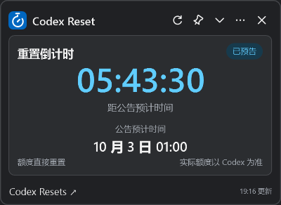
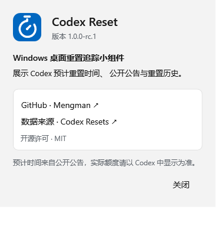

# 当前版本验证记录

## 1.0.1 验收记录

托盘常驻、任务栏与 Alt+Tab 隐藏、默认关闭的开机启动，以及移除菜单最小化操作已完成实现。用户于 2026 年 10 月 2 日确认测试通过，并批准提交和发布 v1.0.1。供验收的本地版本为 [1.0.1-preview.1](../artifacts/releases/CodexResetWidget-1.0.1-preview.1-win-x64.zip)。

Release 编译 0 警告、0 错误，119 项功能、13 项 WPF 场景、66 项桌面检查及 479 个包文件的大小与 SHA256 校验通过。新增检查包括启动／最小化／托盘恢复的任务栏属性、开机启动菜单的默认关闭与显式开关、注册状态重载、路径引用、Windows 禁用状态及读写失败。启动注册检查使用隔离替身，真实登录启动和 Windows 原生 Alt+Tab 列表仍需手动验收。

[构建日志](../artifacts/releases/startup-preview-build.txt)。测试包 SHA256：`A1D0F25EB7002D671057ACD1C3391719D6C5123493CC5765EE9BCFBFCA25E43B`。

正式版本 1.0.1 在提交前再次完成 Release 构建、功能测试、WPF 场景、桌面与发布包检查，全部通过。[正式版本构建日志](../artifacts/releases/v1.0.1-build.txt)。本地 ZIP SHA256：`CD20B28BE58BEEBB946885D0C51E402E1B675AC2908B966F12A88AA53472D7B3`。GitHub CI 将从标签源码重新构建发布包，其校验值以 Release 附件为准。

## 已有发布检查记录

日期：2026 年 10 月 2 日。版本：1.0.0-rc.2。状态：待用户最终检查；干净 Windows 与部分现场验证未完成，不宣称第一版最终验收通过。

## 交付

- [Windows x64 便携 ZIP](../artifacts/releases/CodexResetWidget-1.0.0-rc.2-win-x64.zip)。完整解压后运行 CodexResetWidget.exe。
- [使用与升级说明](release-usage.txt)：包内英文 README.txt 与中文 README.zh-CN.txt 已填入实际版本。
- [第三方声明](third-party-notices.txt)：包内同时提供项目 LICENSE、运行时原始许可与第三方归属文件。
- RELEASE.json 记录版本、SDK、运行时、数据格式版本、文件大小与 SHA256；ZIP 的整体 SHA256 另列于本文。

候选包自带 Microsoft.NETCore.App 与 Microsoft.WindowsDesktop.App 10.0.12。发布目录无 PDB、用户设置、缓存和日志；安装目录无须可写。数据仍保存在 `%LocalAppData%/CodexResetWidget/`，设置与缓存格式保持版本 1。

当前候选包已执行完整 Release 构建与发布验证：0 警告、0 错误，110 项功能、13 项 WPF 场景、60 项桌面检查全部通过。新增双语资源、系统显示语言映射、菜单即时切换、设置兼容与旧缓存提示翻译检查。具体分组见 [开发与测试](development.md)。

## 已执行验证与校验值

完整验证命令（可重新执行）：

```powershell
.\scripts\build.ps1 -Publish -RunUiChecks -RunDesktopChecks -RunLiveChecks -UpgradeDataDirectory artifacts/fixtures/schema-1-user-data
```

- Release 编译：0 警告、0 错误；110 项业务／同步／设置／升级／日志测试通过。
- 13 项 WPF 场景检查、60 项桌面检查通过。
- 479 个包内文件在解压后及应用退出后逐一校验大小与 SHA256；版本、许可、自包含运行时与包内容检查通过。
- 从含中文与空格的目录启动，实际 RuntimeDirectory 指向该解压目录；解压目录运行前后的文件保持一致。
- 正常数据通路获取 56 条历史，完整分页完成；刷新保留阅读对象和月份。
- 从格式版本 1 的测试数据的副本升级后，compact=false、Light、宽 440、高 1020 得到恢复；缓存无读取警告。未使用或修改真实用户数据。

[当前构建日志](../artifacts/releases/language-menu-fix-build.txt) · [业务测试](../artifacts/releases/domain-tests.txt) · [WPF 报告](../artifacts/releases/ui-checks.json) · [桌面报告](../artifacts/releases/desktop-checks.json) · [发布包报告](../artifacts/releases/package-checks.json) · [真实数据报告](../artifacts/releases/live-checks.json) · [升级报告](../artifacts/releases/upgrade-checks.json)

ZIP SHA256：`F6E8FEFF9B128287949495EB03A5D9E19B10580701B591B0E67F064923869E7B`。

[独立校验文件](../artifacts/releases/CodexResetWidget-1.0.0-rc.2-win-x64.zip.sha256)。包体积约 72.7 MiB。

| 真实数据精简态 | 最新关于文案 |
| --- | --- |
|  |  |

[长公告展开态检查截图](assets/expanded-long.png)。截图数据是检查当时的内容，不代表未来的最新公告。

菜单修复后的候选包重新通过 110 项功能、13 项 WPF 场景、60 项桌面及 479 个文件的发布校验。新增检查通过实际子菜单的弹出区域调用英语选项，覆盖从中文切换、关闭菜单、保存和重开后的勾选标记。真实数据与升级检查来自菜单修复前的国际化候选包；本次未改动数据或升级逻辑。

[语言子菜单截图](assets/language-submenu.png)。

## 当前发布与语言行为

1. 支持英文与简体中文，界面、菜单、托盘、关于、提示及日期格式随语言切换。
2. 首次启动跟随 Windows 用户显示语言。本机显示语言为中文，实测默认 System / zh-CN；繁体中文和其他语言映射通过注入文化及桌面检查验证，未修改用户实际显示语言。
3. 菜单提供跟随系统、English 与简体中文，立即生效并保存；切换保留公告正文、阅读位置、日历选择及绝对目标时间。
4. 缺少语言字段的格式版本 1 设置升级为 System，恢复已有模式、主题、位置和尺寸；缓存仍可读取。
5. 英文根 README 链接 docs/README.zh-CN.md，英文布局 PNG／SVG 与现有中文设计图使用同一尺寸及图标，Logo 共用。
6. 修复快速连续切换模式时读取上一帧高度的问题，展开高度按最新请求保存。

[英文展开截图](assets/expanded-en-dark.png) · [中文展开截图](assets/expanded-zh-CN-dark.png)。两张截图使用同一公告与阅读位置。

## 验收覆盖

| 需求标准 | 证据与结论 |
| --- | --- |
| 1. 倒计时与恢复后修正 | 固定时钟与跨目标测试通过；托盘隐藏跨目标后恢复检查通过。真实休眠待现场验证 |
| 2. 时间缺失、预测、过期、网络失败 | 业务与同步测试、WPF 场景检查通过 |
| 3. 到点后日期回顾，无个人成功暗示 | 业务与 WPF 两种模式检查通过；旧缓存离线升级跨目标测试通过 |
| 4. 公告原文与事件对应 | 真实数据检查记录同一公告 ID、时间与来源；缺少作者证据不伪造归属 |
| 5. 日历边界与阅读独立 | 跨月、闰年、跨时区、多事件测试及六行月历桌面检查通过 |
| 6. 深浅主题信息与阅读保持 | WPF 和桌面检查、真实数据刷新阅读保持通过；真实系统主题通知待现场检查 |
| 7. 常见缩放与小屏幕 | 本机单屏 150%；100%／200% 工作区模拟与位置策略通过，实际系统缩放切换及多屏待现场检查 |
| 8. 离线缓存与损坏文件 | 同步及存储测试通过；格式版本 1 的缓存离线恢复通过 |
| 9. 可点击的数据来源 | WPF 来源按钮与 URI 检查通过；本次未自动点击外链干扰浏览器 |
| 10. 模式、键盘、设置与屏幕范围 | 60 项桌面检查覆盖模式恢复、键盘焦点、置顶、托盘、退出及位置策略；物理显示器断开待现场验证 |
| 11. 自包含启动与升级 | ZIP 解压启动、包内运行时加载、无安装目录写入和 格式版本 1 的数据升级通过；未安装 .NET 的干净 Windows 待验证 |
| 12. 时区与夏令时 | 跨日、非整小时偏移、夏令时业务测试与注入时区桌面检查通过；本次未修改用户系统时区 |

100%／200% 工作区模拟不是 Windows 实际缩放变更。截图由 WPF 导出，Mica 使用实色回退，原生边框及系统合成效果不纳入像素验收。

## 已知限制与待验证环境

- 当前机器有开发 SDK。本机加载包内运行时的证据不能替代“未安装 .NET 的干净 Windows 11 x64”验证。
- 实际多屏插拔、系统 DPI 热切换、系统时区修改、真实休眠恢复仍待现场检查。
- 程序未签名；首次下载运行时，Windows 的发布者或 SmartScreen 提示取决于系统策略。
- 不支持同时运行多个版本写入同一用户数据目录；升级前从旧版托盘菜单退出。
- 接口数据属于公开预告与历史记录，不能确认个人账户额度已恢复。

## 用户检查

- [ ] 退出旧版，将候选 ZIP 解压到新目录并直接运行。
- [ ] 检查关于中的版本、文案、Logo 与 GitHub 链接。
- [ ] 检查旧版模式、主题、位置、尺寸与置顶设置是否符合预期。
- [ ] 检查默认系统语言、菜单切换、重启后的语言保持及双语布局。
- [ ] 检查倒计时、公告翻阅、日历及长文滚动。
- [ ] 确认托盘恢复、退出、重启后的设置保持。
- [ ] 在未安装 .NET 的 Windows 11 x64 环境验证完整解压启动。

当前为发布候选版，等待用户最终检查与未验证环境的现场验证。自启动、通知等增强不属于当前版本。
